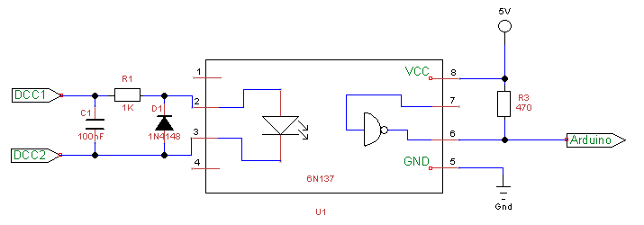

# DCCInspector-EX

Diagnostic/sniffer program for DCC analysis, based on Arduino or ESP target.

The Arduino may be directly connected to another Arduino, e.g. in a
DCC++ or DCC++ EX system, but if used to monitor DCC signals, which are
normally bipolar 12-18V signals, an optocoupler circuit will be required.
Various ones are discussed on the internet, but if you use a 6N137 I 
would recommend a 1nF capacitor across the input pins 2 and 3 to stabilise
the input, and use a pull-up resistor on the output pin 6 of 470 ohms 
connected to +5V - a larger resistor (even the Arduino's internal pull-up)
will generally still work but will slow down the optocoupler.  No 
pull-up resistor is required on pin 7.



If you're using an ESP8266 or ESP32 (3.3V supply) then the top of the pull-up resistor R3 should be
connected to a 3.3V supply pin of the microcontroller, rather than the 5V supply.  The 6N137 should 
still be powered from 5V, or replaced with an optocoupler designed for 3.3V supply.

The default input pin used by the sketch depends on the target used.  For Arduino Uno and Nano, pin 8; 
for Mega, pin 49.  For the ESP8266/ESP32 it's GPIO5 (D2 on a NodeMCU).

The DCCInstpector-EX program supports the Arduino Uno, Nano and Mega particularly.

Measurements are performed at an accuracy of 1/16th of a microsecond using Timer1 input 
capture mode, and calculation results are rounded to 1 microsecond.  For 
increased compatibility with other microcontrollers, it is possible to use the micros()
function to measure times but, 
on an Arduino Uno/Nano/Mega, this introduces up to 3us error in the micros() result, plus up to
6.5us uncertainty in the scheduling of the interrupt which samples
the micros() value; consequently, the measured pulse length will, approximately once every
millisecond, be off by up to 10.5us when using micros() on an Arduino, and the rest of the time
be up to 4us off.

The sketch has also been compiled successfully for the ESP8266 and ESP32, 
currently without any WiFi interface (under development).
On these targets, the timing is performed using the micros() function.  Consequently, 
some inaccuracies due to interrupts are still present, of the order of 4us either way.
The ESP32 has an input capture capability which will be added in due course to improve
the timing accuracy.

The sketch produces output to the Serial stream, by default
once every 4 seconds.  The output statistics includes bit counts, 
bit lengths, checksum errors, packets too long, and estimated 
interrupt time within the DccDiagnostics sketch.  Fleeting input state changes
(<= 3us) are optionally filtered and counted.  A break-down of pulse counts by 
length can also be produced, to monitor the consistency of the DCC signal.

In between statistics output, received DCC packets are decoded and 
printed; duplicate throttle packets and idle packets are not printed more than once per period.

Press '?' to see help of the commands available.  By default the 
breakdown of pulse lengths is not displayed, press 'B' to enabled it.

## Example Output

Example output from DCC++ Classic (5V direct connection, Main Track):

```
-
Bit Count=29782 (Zeros=6687, Ones=23095), Glitches=0
Packets received=608, Checksum Error=0, Lost pkts=0, Long pkts=0
0 half-bit length (us): 100.0 (100-100) delta <= 1
1 half-bit length (us): 58.0 (58-58) delta <= 1
------ Half-bit count by length (us) -------
58	23095	23095
100	6687	6687
--------------------------------------------
Idle 
-
Bit Count=27022 (Zeros=10585, Ones=16436), Glitches=0
Packets received=432, Checksum Error=0, Lost pkts=0, Long pkts=0
0 half-bit length (us): 100.0 (100-100) delta <= 1
1 half-bit length (us): 58.0 (58-58) delta <= 1
------ Half-bit count by length (us) -------
58	16436	16435
100	10586	10586
--------------------------------------------
Loc 7012 Rev128  Stop   11011011 01100100 00111111 00000000 
Loc 3 Forw128 25  00000011 00111111 10011010 

-

```

Example output from DCC++ EX (5V direct connection, Main Track):

```
-
Bit Count=27641 (Zeros=6910, Ones=20731), Glitches=0
Packets received=628, Checksum Error=0, Lost pkts=0, Long pkts=0
0 half-bit length (us): 116.0 (110-122) delta <= 13
1 half-bit length (us): 58.0 (52-64) delta <= 13
--------------------------------------------
Idle 
-
```

## Command Summary

```
 Keyboard commands that can be sent via Serial Monitor:
 1 = 1s refresh time
 2 = 2s 
 3 = 4s (default)
 4 = 8s
 5 = 16s
 6 = 4 DCC packet buffer
 7 = 8
 8 = 16
 9 = 32 (default)
 0 = 64
 a = show accessory packets toggle
 l = show locomotive packets toggle
 d = show diagnostics toggle
 h = show heartbeat toggle
 b = show half-bit counts by length
 c = show cpu/irc usage in sniffer
 f = input filter toggle
 ? = help (show this information)
```