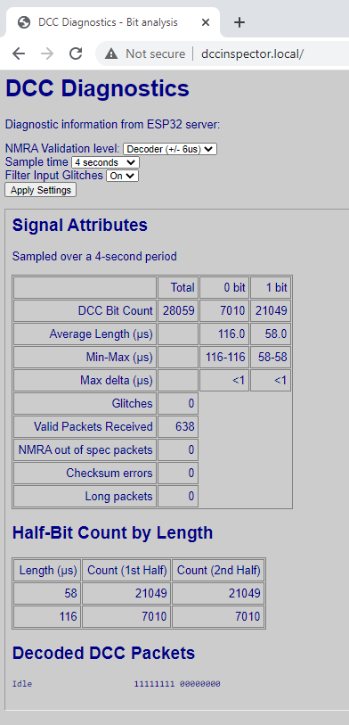

# DccInspector-EX

## Summary

Diagnostic/sniffer program for DCC analysis, based on an Arduino or ESP32 target.
The bit structure and packet structure are analysed and reported, and packets are decoded
and displayed in binary and also in a textual form.

On Arduino, the program produces output to the Serial port.  

On ESP32, it supports HTTP output via WiFi, and will display a reduced set of information
on an OLED display.  A button can be configured to allow the screen to be scrolled to display 
more information.  Development boards such as the Heltec Kit 32 include OLED and a button and
can be used directly.  The ESP32 will go into deep sleep mode (to preserve battery when used stand-alone) if no input 
DCC signal is detected for two minutes, it resumes when reset.

## Hardware Interface

The device may be directly connected to a DCC controller of the same I/O voltage and earth, e.g. in a
DCC++ or DCC++ EX system.  If it is used to monitor DCC signals, which are
normally bipolar 12-18V signals, an optocoupler circuit will be required.

Various circuits are discussed on the internet, but if you use a 6N137 optocoupler I 
would recommend a 1nF capacitor across the optocoupler input to stabilise the DCC input signal.  
Without this the opto-isolator may experience ringing, causing fleeting interrupts on the input 
(recorded as 'glitches' in the diagnostics).

I use a pull-up resistor of 470 ohms (labelled R3 below) on the output pin 6, connected to 5V; 
a larger resistor (even the Arduino's internal pull-up) will generally still work but may slow 
down the optocoupler.  Using the internal pull-up (~25Kohm), the rise-time on the signal is some microseconds 
in length, compared to around 200ns with a 470 (or 330) ohm pull-up.  This may be acceptable in a decoder where the
timing requirements may be relaxed, but a faster response is preferred for a diagnostic tool.

No connection is necessary to pin 7, although some versions of the circuit show a pull-up resistor here.


Strictly, the 6N137 isn't rated for the 3.3V supply used on an ESP8266 or ESP32.
I've had good results running with the circuit shown above with a 3.3V supply (replacing R3 with 330 ohm), 
but if you want to do things properly, the VCC terminal of the 6N137 should be
connected to +5V, or the optocoupler should be replaced with a 3.3V tolerant optocoupler.  In either case,
R3 should be connected to +3.3V to avoid putting too high a voltage on the ESP's input pin.

The default input pin used by the sketch depends on the target used.  For Arduino Uno and Nano, pin 8; 
for Mega, pin 49.  For the ESP8266/ESP32 it's GPIO2 (labelled D4 on the 8266 NodeMCU).

## Target Platforms

The diagnostic program supports the Arduino Uno, Nano, Mega and ESP32 particularly.

On Arduino, measurements are performed at an accuracy of 1/2 or 1/16th microsecond using Timer1 input 
capture mode, and calculation results are rounded to 1 microsecond.  

For increased compatibility with other microcontrollers, it is possible to use the micros() function for timing.
However, on an Arduino Uno/Nano/Mega this introduces up to 3us error in the micros() result, plus up to
6.5us uncertainty in the scheduling of the interrupt which samples the micros() value; consequently, the 
measured pulse length will, approximately once every millisecond, be off by up to 10us, and the rest of 
the time be up to 3us out.  This mode of operation is not recommended.

The sketch also supports the ESP8266 and ESP32.
On the ESP8266, the timing is performed using the micros() function.  Consequently, 
some inaccuracies due to interrupts are still present, of the order of 4us either way.  

The ESP32 runs in input capture mode, which works very well and potentially can support a 
measurement accuracy of around 4ns.  The sketch uses the default 12.5ns timer resolution and rounds 
the results to 1us accuracy.

## WiFi and Web Browser

On ESP8266 and ESP32, an HTTP server is provided which allows the output to be viewed from
a standard browser.  The first time the device starts, it will attempt to get WiFi credentials from the
router using WPS protocol.   Press the WPS button on the router before resetting the device, and
the device should connect to the router.  When the device is reset or started in future, it will 
connect using the same credentials by preference.



## Serial USB Output

The sketch produces output to the Serial stream, by default
once every 4 seconds.  The output statistics includes bit counts, 
bit lengths, checksum errors, packets too long, and 
time spent within the interrupt code.  Fleeting input state changes
(<= 3us) are optionally filtered and counted.  A break-down of pulse counts by 
length can also be produced, to monitor the consistency of the DCC signal.
The bit stream is validated against the specifications in NMRA S-9.1 (2020) for bit length 
and delta.  The validation can be selected through the serial monitor to be strict=0 (no validation), strict=1 
(NMRA Decoder compliance level) or strict=2 (NMRA Controller compliance level).  
The number of packets rejected due to non-compliance is recorded and displayed.

In between statistics output, received DCC packets are decoded and 
printed; duplicate throttle packets and idle packets are however not printed more than once per period.

Press '?' in the serial monitor to see help of the commands available.  The 
breakdown of pulse lengths is not displayed by default, press 'B' to enabled it.  
Likewise, the CPU statistics are not displayed by default, press 'C' to enable them.

## Example Output On Serial USB

### Example Uno Monitoring DCC++ EX 3.0.10 (5V, 6N137 Optocoupler, Main Track, Strict NMRA):
All DCC packets are within the NMRA specification
and the pulse lengths are always within 1us of the target lengths of 116us and 58us.

This demonstrates the improvements in pulse quality which were introduced in DCC++EX in 
version 3.0.5 when running on an ATmega2560 board with standard motor pins, compared to the pulse lengths
measured for the DCC++EX version 3.0.4 below.  It is achieved by using the Arduino's
hardware PWM capabilities to generate the pulse transitions; this is accurate to one clock cycle,
i.e. 1/16th of a microsecond, although the measurement accuracy is reduced slightly by the optocoupler circuit.

```
-
Bit Count/4 sec=25621 (Zeros=9134, Ones=16486), Glitches=0
Valid Packets=446, NMRA out of spec=0, Checksum Errors=0, Lost pkts=0, Long pkts=0
0 half-bit length (us): 115.9 (115-116) delta < 1
1 half-bit length (us): 57.9 (57-58) delta < 1
------ Half-bit count by length (us) -------
57	3218	0
58	13270	16490
115	2444	150
116	6690	8984
--------------------------------------------
--
Loc 3 Rev128 25         00000011 00111111 00011010
Loc 7979 Fwd128 122     11011111 00101011 00111111 11111011
-
```

### Example ESP32 Monitoring DCC++ EX 3.0.4 (5V, 6N137 Optocoupler, Main Track, Strict NMRA)
When the DCC signal is generated within interrupt handling code within the Command Station, the accuracy of 
the signal cannot be maintained to such a high accuracy.  Below, we can see that the pulse length varies over a range of around 14us.  
This would mean that some packets are outside of the NMRA specification and may be ignored by the loco decoder.
The analyser reports 81 packets as out of spec and 351 in-spec, i.e. around 20% are out of spec.  This is not 
normally a problem on a DCC layout as each packet is transmitted at least three times.  If one packet doesn't get 
through, the probability is that one of the retransmissions will!

The half-bit counts are turned off here, but CPU monitoring within the analyser is turned on.

```
-
Bit Count/4 sec=24865 (Zeros=10167, Ones=14697), Glitches=0
Valid Packets=351, NMRA out of spec=81, Checksum Errors=0, Lost pkts=0, Long pkts=0
0 half-bit length (us): 115.9 (109-122) delta < 14
1 half-bit length (us): 57.5 (51-64) delta < 14
IRC Duration (us): 2.2 (1-10),  CPU load: 27.5%
--
Loc 7552 Fwd128 33      11011101 10000000 00111111 10100010
Loc 3 Fwd128 25         00000011 00111111 10011010
-
```

### Example Uno Monitoring DCC++ Classic (5V direct connection, Main Track, Strict NMRA):
The original DCC++ Classic also uses the hardware PWM capabilities of the Arduino to generate the 
DCC pulse transitions.  This is capable of accuracy to within one clock cycle, as demonstrated in
the results below.

```
-
Bit Count/4 sec=27573 (Zeros=9881, Ones=17692), Glitches=0
Valid Packets=411, NMRA out of spec=0, Checksum Errors=0, Lost pkts=0, Long pkts=0
0 half-bit length (us): 100.0 (100-100) delta < 1
1 half-bit length (us): 58.0 (58-58) delta < 1
IRC Duration (us): 29.8 (27-39),  CPU load: 54.6%
------ Half-bit count by length (us) -------
58      17692   17692
100     9882    9882
--------------------------------------------
--
Loc 7801 Fwd128 55      11011110 01111001 00111111 10111000
Loc 2323 Fwd128 5       11001001 00010011 00111111 10000110
-
```


## Command Summary

Keyboard commands that can be sent via Serial Monitor:

```
 1 = 1s refresh time
 2 = 2s 
 3 = 4s (default)
 4 = 8s
 5 = 16s
 6 = 4 DCC packet buffer
 7 = 8
 8 = 16
 9 = 32 (default)
 0 = 64
 a = show accessory packets toggle
 l = show locomotive packets toggle
 d = show diagnostics toggle
 h = show heartbeat toggle
 b = show half-bit counts by length
 c = show cpu/irc usage in sniffer
 f = input filter toggle
 s = set NMRA compliance strictness (0=none,1=decoder,2=controller)
 ? = help (show this information)
```
