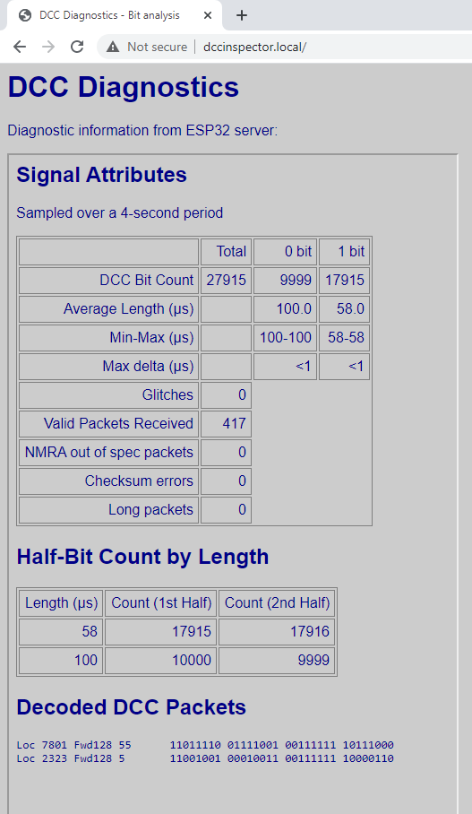

# DccDiagnostics

## Summary

Diagnostic/sniffer program for DCC analysis, based on an Arduino or ESP32 target.
The bit structure and packet structure are analysed and reported, and packets are decoded
and displayed in binary and also in a textual form.

On Arduino, the program produces output to the Serial port.  

On ESP32, it supports HTTP output via WiFi, and will display a reduced set of information
on an OLED display.  A button can be configured to allow the screen to be scrolled to display 
more information.  Development boards such as the Heltec Kit 32 include OLED and a button and
can be used directly.

## Hardware Interface

The controller may be directly connected to another controller of the same I/O voltage, e.g. in a
DCC++ or DCC++ EX system, but if used to monitor DCC signals, which are
normally bipolar 12-18V signals, an optocoupler circuit will be required.
Various ones are discussed on the internet, but if you use a 6N137 I 
would recommend a 100nF capacitor across the DCC input to stabilise
on the input, and use a pull-up resistor on the output pin 6 of 330 ohms (connected to 3.3V) or 470 ohms 
(connected to 5V) - a larger resistor (even the Arduino's internal pull-up)
will generally still work but will slow down the optocoupler.  No 
pull-up resistor is required on pin 7.


If you're using an ESP8266 or ESP32 (3.3V supply) then, strictly, the 6N137 isn't rated for 3.3V.
I've had good results running with a 3.3V supply, but ideally the top of the resistor R3 should be
connected to a 3.3V pin of the microcontroller and VCC terminal of the 6N137 should still be 
connected to +5V, or the optocoupler should be replaced with a 3.3V tolerant optocoupler.

The default input pin used by the sketch depends on the target used.  For Arduino Uno and Nano, pin 8; 
for Mega, pin 49.  For the ESP8266/ESP32 it's GPIO2 (labelled D4 on the 8266 NodeMCU).

The diagnostic program supports the Arduino Uno, Nano, Mega and ESP32 particularly.

On Arduino, measurements are performed at an accuracy of 1/2 or 1/16th microsecond using Timer1 input 
capture mode, and calculation results are rounded to 1 microsecond.  For 
increased compatibility with other microcontrollers, it is possible to use micros() instead but, 
on an Arduino Uno/Nano/Mega, this introduces up to 3us error in the micros() result, plus up to
6.5us uncertainty in the scheduling of the interrupt which samples
the micros() value; consequently, the measured pulse length will, approximately once every
millisecond, be off by up to 10us when using micros() on an Arduino, and the rest of the time
be up to 3us off.

The sketch also supports the ESP8266 and ESP32.
On the ESP8266, the timing is performed using the micros() function.  Consequently, 
some inaccuracies due to interrupts are still present, of the order of 4us either way.  The ESP32
uses its input capture mode which works very well and potentially can support a measurement accuracy of around 4ns.

## WiFi and Web Browser

On ESP8266 and ESP32, an HTTP server is provided which allows the output to be viewed from
a standard browser.  The first time the device start, it will attempt to get WiFi credential from the
router using WPS protocol.   Press the WPS button on the router before 
resetting the device, and the device should connect to the router.  When reset or started in future, it will 
connect using the same credentials by preference.



## Serial USB Output

The sketch produces output to the Serial stream, by default
once every 4 seconds.  The output statistics includes bit counts, 
bit lengths, checksum errors, packets too long, and 
time spent within the interrupt code.  Fleeting input state changes
(<= 3us) are optionally filtered and counted.  A break-down of pulse counts by 
length can also be produced, to monitor the consistency of the DCC signal.

In between statistics output, received DCC packets are decoded and 
printed; duplicate throttle packets and idle packets are however not printed more than once per period.

Press '?' in the serial monitor to see help of the commands available.  The 
breakdown of pulse lengths is not displayed by default, press 'B' to enabled it.  
Likewise, the CPU statistics are not displayed by default, press 'C' to enable them.

## Example Output On Serial USB

Example Uno output from DCC++ Classic (5V direct connection, Main Track):

```
-
Bit Count=29782 (Zeros=6687, Ones=23095), Glitches=0
Packets received=608, Checksum Error=0, Lost pkts=0, Long pkts=0
0 half-bit length (us): 100.0 (100-100) delta < 1
1 half-bit length (us): 58.0 (58-58) delta < 1
------ Half-bit count by length (us) -------
58	23095	23095
100	6687	6687
--------------------------------------------
Idle                    11111111 00000000
-
Bit Count=27022 (Zeros=10585, Ones=16436), Glitches=0
Packets received=432, Checksum Error=0, Lost pkts=0, Long pkts=0
0 half-bit length (us): 100.0 (100-100) delta < 1
1 half-bit length (us): 58.0 (58-58) delta < 1
------ Half-bit count by length (us) -------
58	16436	16435
100	10586	10586
--------------------------------------------
Loc 7012 Rev128  Stop   11011011 01100100 00111111 00000000 
Loc 3 Forw128 25        00000011 00111111 10011010 

-

```

Example Uno output from DCC++ EX (5V direct connection, Main Track):

```
-
Bit Count=27641 (Zeros=6910, Ones=20731), Glitches=0
Packets received=628, Checksum Error=0, Lost pkts=0, Long pkts=0
0 half-bit length (us): 116.0 (110-122) delta < 13
1 half-bit length (us): 58.0 (52-64) delta < 13
--------------------------------------------
Idle                    11111111 00000000 
-
```

Example ESP32 output from DCC++ (12V, 6N137 Optocoupler, Main Track):

```
-
Bit Count/4 sec=28842 (Zeros=8611, Ones=20231), Glitches=0
Packets received=430, Checksum Error=0, Lost pkts=0, Long pkts=0
0 half-bit length (us): 99.5 (99-100) delta < 2
1 half-bit length (us): 57.5 (57-58) delta < 2
IRC Duration (us): 2.1 (2-14),  CPU load: 34.0%
--
Loc 8683 Fwd128 25      11100001 11101011 00111111 10011010
Loc 7025 Fwd128 25      11011011 01110001 00111111 10011010
Loc 7130 Fwd128 25      11011011 11011010 00111111 10011010
Loc 6025 Fwd128 25      11010111 10001001 00111111 10011010
-
```

## Command Summary

Keyboard commands that can be sent via Serial Monitor:

```
 1 = 1s refresh time
 2 = 2s 
 3 = 4s (default)
 4 = 8s
 5 = 16s
 6 = 4 DCC packet buffer
 7 = 8
 8 = 16
 9 = 32 (default)
 0 = 64
 a = show accessory packets toggle
 l = show locomotive packets toggle
 d = show diagnostics toggle
 h = show heartbeat toggle
 b = show half-bit counts by length
 c = show cpu/irc usage in sniffer
 f = input filter toggle
 ? = help (show this information)
```
